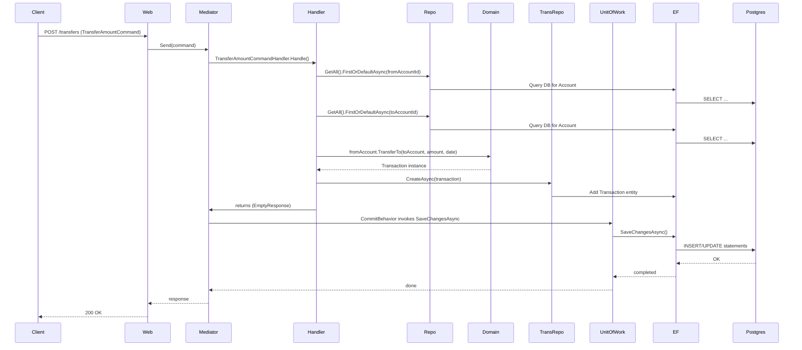

# PaymentProcessing - Architecture

This document summarizes the architecture of the PaymentProcessing solution. It was generated by scanning the repository and reading project files, source code, and configuration.

## Summary / Solution Structure

- Solution: PaymentProcessing.slnx
- Target frameworks: net10.0 (all projects)

- Projects found:
  - PaymentProcessing.Web
	- Type: ASP.NET Minimal API (Microsoft.NET.Sdk.Web)
	- Key files: Program.cs, Endpoints.cs, WebModule.cs, ExceptionHandlerMiddleware
	- Packages: Autofac, MediatR, FluentValidation, EF Core, Npgsql, Swashbuckle

  - PaymentProcessing.Application
	- Type: Application layer (class library)
	- Responsibilities: Commands / Queries, MediatR handlers, validation and pipeline behaviors
	- Key patterns: MediatR (CQRS), FluentValidation, Pipeline behaviors (ValidationBehavior, CommitBehavior)
	- Packages: MediatR, FluentValidation, Npgsql EF provider (reference)

  - PaymentProcessing.DataAccess
	- Type: Infrastructure / Persistence (class library)
	- Responsibilities: EF Core DbContext (EFContext), repository implementations, UnitOfWork, EF model configurations and migrations
	- Packages: Microsoft.EntityFrameworkCore, Microsoft.EntityFrameworkCore.Tools, Npgsql.EntityFrameworkCore.PostgreSQL

  - PaymentProcessing.Domain
	- Type: Domain model (class library)
	- Responsibilities: Entities and domain logic
	- Key entities: Customer, Account, Transaction, EntityBase, DomainException

  - PaymentProcessing.IntegrationTests
	- Type: Integration tests (xUnit)
	- Packages: xUnit, Microsoft.NET.Test.Sdk, Playwright.xunit, EF Core


## Dependencies and Frameworks

- .NET Target Framework: net10.0 across projects.
- DI: Autofac as the container (WebModule registers validators, repositories and UnitOfWork).
- Messaging / CQRS: MediatR used to dispatch requests (commands and queries).
- Validation: FluentValidation validators are registered and executed via ValidationBehavior in MediatR pipeline.
- Persistence: EF Core with Npgsql (PostgreSQL) provider. EFContext configures model from assembly and uses connection string from configuration via DatabaseOptions.
- API surface: Minimal APIs mapped in Endpoints.cs; Swagger (Swashbuckle) enabled in development.


## Architecture clues & Patterns

- Clean / layered architecture split into Web (API), Application (use-cases / orchestration), Domain (business rules), DataAccess (persistence).
- CQRS-style separation: Commands and Queries implemented as MediatR requests with separate handlers.
- Domain-centric business logic: Account entity contains TransferTo logic (validations: same currency, sufficient funds, non-self transfer). Domain throws DomainException with codes.
- Repository pattern + UnitOfWork wrapping EF Core context. Generic Repository<TEntity> is used by handlers.
- Pipeline behaviors:
  - ValidationBehavior: runs FluentValidation validators and maps validation failures to RequestValidationException.
  - CommitBehavior: after handler completes, calls IUnitOfWork.SaveChangesAsync to persist changes.
- Minimal API endpoints map directly to MediatR requests; web layer is very thin and acts as entry point only.


## Application layer (detailed)

- Responsibilities:
  - Receive and validate incoming commands/queries (via MediatR pipeline).
  - Orchestrate calls to repositories and domain behaviour.
  - Do not contain persistence implementation details (they depend on IRepository<T> abstractions).

- Key files and concepts:
  - Commands: CreateCustomerCommand, CreateAccountCommand, TransferAmountCommand
  - Queries: GetCustomersQuery, GetAccountsQuery
  - Handlers: CreateCustomerCommandHandler, CreateAccountCommandHandler, TransferAmountCommandHandler — these create domain entities, call repository methods and throw DomainException on business failures
  - Validation: per-command validators registered via FluentValidation and wired into DI. ValidationBehavior throws RequestValidationException on invalid input.
  - CommitBehavior: ensures SaveChangesAsync is called once the handler returns successfully (transaction commit semantic depends on EF config)


## Domain and Business Logic

- Domain model is located in PaymentProcessing.Domain. Entities:
  - Customer: Name, Email, Accounts collection.
  - Account: Balance, Currency, CustomerId, TransferTo method implementing domain invariants: cannot transfer to same account, currencies must match, cannot withdraw more than balance. Implements Deposit and Withdraw as encapsulated behaviors.
  - Transaction: FromAccount/ToAccount, Amount, CreatedAt.

- Domain exceptions and codes: DomainException and ExceptionReasonCode enumerations are used to represent business errors (e.g., AccountNotFound, InsufficientFunds, CannotTransferToSameAccount).


## Infrastructure, Persistence, Integrations, and Deployment

- Persistence: EFContext (DbContext) exposes DbSet<Customer>, DbSet<Account>, DbSet<Transaction>. OnConfiguring uses Npgsql connection string from DatabaseOptions (set from configuration/appsettings). Migrations are present in DataAccess/Migrations.

- Repository: Generic Repository<TEntity> with methods CreateAsync, DeleteAsync, UpdateAsync, and GetAll() returning IQueryable<TEntity>.

- Unit of Work: UnitOfWork.SaveChangesAsync delegates to EFContext.SaveChangesAsync.

- DI: WebModule registers:
  - Validators as IFluentValidator
  - Generic Repository<T> as IRepository<T>
  - UnitOfWork as IUnitOfWork

- Hosting and middleware: Program.cs configures minimal API, Swagger, HTTPS redirection, ExceptionHandlerMiddleware, and maps endpoints.

## Typical request flow (component & sequence diagrams)

### Component diagram


```mermaid
flowchart LR
  Client[Client API Consumer] -->|HTTP| Web[PaymentProcessing.Web\n(Minimal API)]
  Web -->|IMediator.Send()| Mediator[MediatR]
  Mediator --> Application[Application Layer\n(Commands / Queries / Handlers)]
  Application --> Domain[Domain Layer\n(Entities & Business Logic)]
  Application --> Repo[Repository<T> (IRepository)]
  Repo --> EF[EFContext (DbContext)]
  EF -->|Npgsql| Postgres[(PostgreSQL)]
  Web -->|Swagger UI| Dev[Developer / DevTools]
```

### Sequence diagram: Transfer flow


